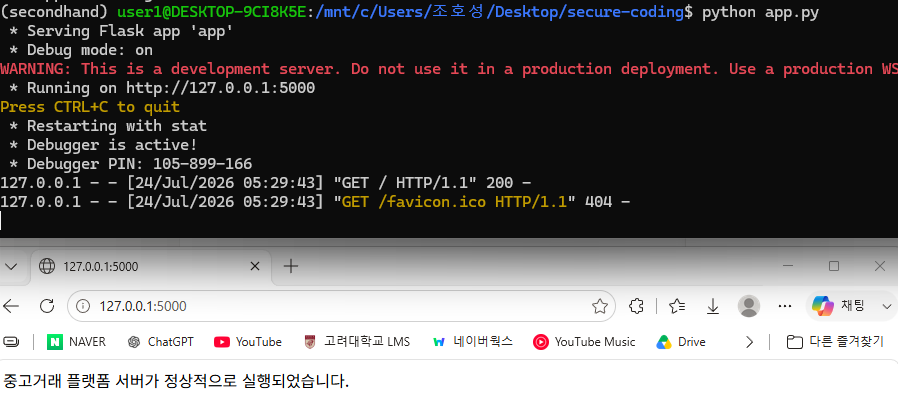

# [WHS][secure-coding][39반]조호성(0531)

제출일: 2026년 7월 24일

# 1. 개요

본 과제에서는 소프트웨어 개발 주기(요구사항 도출, 시스템 설계, 시스템 구현, 테스팅, 유지 보수)를 따라 중고거래 플랫폼을 구현해보고, 구현 과정 속에서 보안 약점을 발견하고 해결하는 것을 목적으로 한다. 플랫폼 구현을 위해 chatGPT 5.6의 도움을 받았다.

# 2. 요구사항 도출

중고거래 플랫폼 구현에 반드시 필요하다고 판단되는 기능 또는 서비스는 다음과 같다.

- 사람들이 플랫폼에 회원가입하여 플랫폼이 제공하는 서비스를 이용할 수 있어야 한다.
- 플랫폼에 가입된 사용자는 상품명, 상품 사진, 그리고 금액이 포함된 게시글을 작성할 수 있어야 한다.
- 사용자가 원하는 상품을 검색창에서 검색할 수 있어야 한다
- 플랫폼에 가입된 사용자는 상품 사진과 금액이 포함된 게시글을 열람할 수 있어야 한다.
- 사용자 간 돈을 주고받을 수 있어야 한다.

이외에도  관리자 기능, 악성 유저 신고 기능, 댓글 기능, 게시글 삭제 기능 등 세부적인 요구사항들이 존재하나 한정된 시간과 예산 속에서 구현해내기는 어렵다고 판단하였다. 따라서 위 5가지 요구사항을 충실하게 반영하도록 하되 보안적인 문제점들을 고려하여 과제를 수행하였다.

# 3. 시스템 설계

## (1) 사람들이 플랫폼에 회원가입하여 플랫폼이 제공하는 서비스를 이용할 수 있어야 한다.

- 로그인 페이지가 존재하여야 한다. 사용자가 입력한 아이디와 비밀번호가 일치하면, 로그인하여 플랫폼 메인 화면으로 진입한다.
- 플랫폼 메인 페이지에서 로그아웃 버튼을 클릭하여 로그아웃할 수 있어야 한다. 로그아웃 버튼을 클릭하면, 로그인 페이지로 다시 돌아온다.
- 회원가입 페이지가 존재하여야 한다. 회원가입 페이지는 로그인 페이지에서 '회원가입하기' 버튼을 누르면 넘어갈 수 있다. 회원가입 페이지에서 사용할 아이디와 비밀번호, 비밀번호 확인을 입력하면 계정이 생성된다. 이 때 아이디 중복 확인이 진행되어야 한다.
- 유저의 아이디와 비밀번호의 해시값은 데이터베이스의 형태로 서버에 저장된다.

## (2) 플랫폼에 가입된 사용자는 상품명, 상품 사진, 그리고 금액이 포함된 게시글을 작성할 수 있어야 한다.

- 상품등록 페이지가 존재하여야 한다. 플랫폼 메인 화면에서 '상품 등록하기' 버튼을 눌러 상품등록 페이지로 넘어갈 수 있다.
- 상품 사진을 업로드할 수 있어야 하고, 상품명과 상품 금액을 입력할 수 있어야 한다.
- 상품 등록을 완료하면, 상품명, 상품 사진과,금액이 서버에 저장된다.
- 상품 등록 완료 후, 플랫폼 메인 화면으로 이동한다.

## (3) 사용자가 원하는 상품을 검색창에서 검색할 수 있어야 한다.

- 플랫폼 메인 페이지에 검색창이 존재하여야 한다. 검색창에 사용자가 원하는 키워드를 넣으면, 키워드가 포함된 상품명에 해당하는 게시글만 노출된다.
- 검색 페이지에 나타난 게시글들은 목록 형태로 표시되며, 각 항목에는 상품명, 상품 사진, 금액이 포함되어 있어야 한다.
- 검색 페이지에 검색창과 플랫폼 메인 페이지로 돌아갈 수 있는 '메인 화면으로' 버튼이 존재하여야 한다.

## (4) 플랫폼에 가입된 사용자는 상품 사진과 금액이 포함된 게시글을 열람할 수 있어야 한다.

- 상품이 포함된 게시글에는 상품명, 상품 사진, 금액이 포함되어야 한다.
- 상품 사진은 검색 페이지에 노출된 상품 사진 크기보다 커야 한다.
- '뒤로가기' 버튼을 눌러 이전 검색 페이지로 돌아갈 수 있어야 한다.

## (5) 사용자 간 돈을 주고받을 수 있어야 한다.

- 상품 게시글 페이지에서, '구매하기' 버튼을 눌러 상품 가격만큼 구매자의 잔액을 차감하여야 한다.
- 다만, 실제 화폐의 송금이나 거래는 이루어지지 않는다.
- 구매자가 '구매하기' 버튼을 누르면, '구매하기' 버튼이 '판매 완료'로 바뀌어 더 이상의 상품 거래가 이루어지지 않도록 한다.

# 4. 시스템 구현

## (1) 개발 환경 도구

| 개발 환경 도구 | 용도 |
| --- | --- |
| **Ubuntu** | 리눅스 환경에서 프로젝트를 실행하고 명령어를 입력하는 데 사용 |
| **Miniconda** | Python 버전과 프로젝트 가상환경을 관리하고 필요한 패키지를 설치하는 데 사용 |
| **Visual Studio Code** | Python, HTML, CSS 코드를 작성하고 수정하는 데 사용 |
| **Flask** | 로그인, 회원가입, 상품 등록, 검색, 구매 처리를 담당하는 웹 서버 구현 |
| **Flask-SQLAlchemy** | 사용자와 상품 정보를 SQLite 데이터베이스에 저장하고 조회하는 데 사용 |
| **SQLite** | 아이디, 비밀번호 해시값, 잔액, 상품명, 금액, 사진 경로, 판매 상태 저장 |
| **Chrome** | 완성된 웹사이트에 접속하여 기능을 확인하고 테스트하는 데 사용 |
| **Git** | 커밋하고 GitHub에 업로드하는데 사용 |
| **GitHub** | 과제 제출하는데 사용 |
| **ngrok** | 로컬에서 실행 중인 Flask 서버를 외부에서 접속할 수 있도록 공개하는 데 사용 |

## (2) 개발 환경 구축

### (a) Ubuntu 기본 프로그램 설치

| 프로그램 | 용도 |
| --- | --- |
| `git` | 코드를 GitHub에 올리는 데 사용 |
| `curl` | 인터넷 요청 및 파일 다운로드 |
| `wget` | Miniconda 설치 파일 다운로드 |

```powershell
sudo apt install -y git curl wget // git, curl, wget 설치
```

git, curl, wget 프로그램을 설치한다. Github에 commit하고 push하는데 git가 필요하고, 인터넷에 파일을 요청하고 다운로드하는데 curl이 필요하다.

### (b) python 환경 생성

```powershell
conda create -n secondhand python=3.12 -y
conda activate secondhand

```

프로젝트와 패키지가 섞이지 않도록 별도의 환경을 구축하고, 환경을 활성화한다.

### (c) 프로젝트 폴더 및 파일 생성

```powershell
mkdir secondhand-platform // 프로젝트 폴더 생성
mkdir templates static static/css static/uploads instance
touch app.py
touch templates/login.html
touch templates/register.html
touch templates/main.html
touch templates/product_register.html
touch templates/search.html
touch templates/product_detail.html
touch static/css/style.css
touch .gitignore
touch README.md
pip freeze > requirements.txt
```

프로젝트 폴더와 중고거래 플랫폼을 만드는데 필요한 html과 css 파일들을 만들어둔다.

## (3) Flask로 서버 띄우기

Flask를 이용하여 중고거래 플랫폼 서버를 실행하도록 할 수 있으므로, Flask로 서버를 띄우는 파이썬 코드를 작성하였다.

```powershell
cat > app.py <<'EOF'
from flask import Flask

app = Flask(__name__)

@app.route("/")
def index():
    return "중고거래 플랫폼 서버가 정상적으로 실행되었습니다."

if __name__ == "__main__":
    app.run(debug=True)
EOF
```



127.0.0.1:5000을 주소창에 입력하여 들어갔더니, 정상적으로 작동하였다.

## (4) 로그인 HTML 파일 작성

로그인 html 파일을 제작하였고, 이에 따라 수정된 app.py의 주요 부분은 다음과 같다.

```powershell
from flask import Flask, render_template, request
# Flask로 웹 서버를 생성하고, render_template으로 HTML 파일을 브라우저에 전달한다.
# request를 이용하여 사용자가 입력한 값을 받는다.
```

```powershell
@app.route("/")
def index():
    return render_template("login.html")
# 기본 주소로 접속하게 될 경우, 로그인 페이지를 보여준다.
```

```powershell
@app.route("/login", methods=["POST"])
def login():
# 로그인 버튼을 누르면, HTML 폼이 /login 주소로 아이디와 비밀번호를 보낸다.
```

```powershell
username = request.form.get("username")
password = request.form.get("password")
# 아이디와 패스워드를 사용자가 입력한 값으로 저장한다.
```


위 그림과 같이 중고거래 플랫폼 로그인 페이지가 구현되었다. 아이디에 “abcd”, 비밀번호에 “1234”를 입력하고 로그인 버튼을 클릭하면


그림과 같이 입력 전달에 성공한 것을 알 수 있다. 다만 최종 구현에서는 아이디와 비밀번호를 화면에 노출시키지는 않을 것이다.

## (5) 회원가입 페이지 만들기 및 사용자 데이터베이스 저장


회원 가입 페이지를 구현하였고, 아이디와 비밀번호, 비밀번호 확인란을 채우고 계정 생성을 누르면 계정 생성이 완료되고 로그인 페이지로 돌아오게 된다. 이때 아이디와 비밀번호 정보는 market.db 파일에 저장된다.


앞서 아이디=”abcd”, 비밀번호=”1234”로 설정하여 회원가입을 진행하였다.  아이디와 비밀번호를 올바르게 입력 후 로그인 버튼을 누르면, 로그인에 성공하고, 중고거래 플랫폼 메인 페이지로 진입한다. 오른쪽 상단의 로그아웃 버튼을 누르면 다시 로그인 페이지로 돌아오게 된다.


반면 아이디=”abcd”, 비밀번호=”12345”로 로그인을 시도하면, 위 사진과 같이 “아이디 또는 비밀번호가 올바르지 않습니다”라는 문구가 뜨며, 계속 로그인 화면에 머무르게 된다.


로그인/로그아웃에 성공하면 초록색으로 표시되고, 로그인 성공/실패 여부와 관계없이 모든 로그인 시도 이력을 터미널 창에서 확인할 수 있다.

## (6) 상품 등록 페이지 제작


중고거래 플랫폼 메인 페이지의 로그아웃 버튼 왼쪽에 ‘상품 등록하기’ 버튼이 추가되었다. 상품 등록하기 페이지로 진입하면, 상품명, 상품 금액을 입력할 수 있으며, 상품 사진은 직접 첨부가 가능하다.

‘상품 등록하기’ 버튼을 클릭하면 메인 페이지로 돌아가며, 등록된 상품 목록에서 내가 등록한 상품을 확인할 수 있다.


## (7) 검색 페이지 제작


‘곰’을 검색창에 입력하면 곰인형이 정상적으로 검색되지만, ‘성’을 검색창에 입력하면 곰인형이 검색되지 않는 것을 발견할 수 있다.

## (8) 상품 페이지 제작


곰인형을 누르면, 곰인형의 이미지가 확대되어 있는 상품 페이지로 이동이 가능하다. 이 페이지를 따로 제작한 이유는, 상품 결제가 개별 상품 페이지 내에서만 이루어지도록 하기 위해서이다.

## (9) 구매하기, 잔액 차감, 판매 완료 처리하기


위와 같이 자신의 상품인 경우에는 구매하기 버튼을 누를 수 없고, 자신의 상품이 아닌 경우에는 구매하기 버튼이 잘 눌러진다.


구매하기 버튼을 클릭하면, 구매하기 버튼이 판매 완료로 바뀌면서 잔금이 차감된다.

# 5. 테스팅

## (1) 체크리스트 작성 및 테스트 결과

| 번호 | 점검 항목 | 결과 |
| --- | --- | --- |
| 1 | 회원가입 시 아이디 중복과 비밀번호 확인이 정상적으로 처리되는가 | ✅ |
| 2 | 비밀번호가 평문이 아니라 해시값으로 데이터베이스에 저장되는가 | ✅ |
| 3 | 올바른 계정으로 로그인하고 로그아웃할 수 있는가 | ✅ |
| 4 | 로그인한 사용자가 상품명, 가격, 사진을 입력해 상품을 등록할 수 있는가 | ✅ |
| 5 | 등록한 상품 정보가 서버와 데이터베이스에 저장되는가 | ✅ |
| 6 | 상품명을 기준으로 검색하고 검색 결과를 조회할 수 있는가 | ✅ |
| 7 | 상품 상세 페이지에서 상품명, 사진, 가격을 확인할 수 있는가 | ✅ |
| 8 | 구매 시 구매자 잔액은 감소하고 판매자 잔액은 증가하는가 | ✅ |
| 9 | 구매 완료 후 상품이 판매 완료 상태로 변경되고 재구매가 차단되는가 | ✅ |
| 10 | 자신의 상품 구매와 잔액 부족 상태의 구매가 차단되는가 | ✅ |


각 항목에 대해 직접 실행해보면서 체크리스트를 점검하였고, 점검 결과 10개 항목 모두 제대로 구현되었음을 확인할 수 있었다.

# 6. 유지 보수

- 회원가입, 로그인, 상품 등록, 검색, 구매 기능이 계속 정상적으로 작동하는지 주기적으로 확인한다.

**⇒ DDoS 공격이나 서버 장애로 트래픽 처리가 마비되면 시스템의 가용성이 침해되어 핵심 기능이 정상적으로 작동하지 않을 수 있기 때문이다. 따라서 주요 기능의 정상 작동 여부와 서버 상태를 지속적으로 점검해야 한다.**

- 오류가 발생하면 재현 조건과 원인을 기록하고, 수정 후 동일한 문제가 다시 발생하지 않는지 재시험한다.

**⇒ 이는 보안 전문가가 가져야 할 기본적인 태도라고 생각한다. 1:10:100의 법칙에 따르면 문제를 예방하는 데 드는 비용이 1이라면, 문제를 교정하는 비용은 10, 문제가 실제로 발생한 뒤 처리하는 비용은 100까지 증가할 수 있다. 따라서 문제가 커지기 전에 원인을 파악하고 수정하는 것이 장기적으로 비용과 시간을 절약하는 방법이다.**

- 사용자와 상품 데이터가 손상되지 않도록 SQLite 데이터베이스 파일을 정기적으로 백업한다.

**⇒ 해킹, 시스템 오류, 파일 손상 등으로 데이터베이스가 유실되더라도 백업 파일을 이용해 사용자 정보와 상품 정보를 복구할 수 있기 때문이다.**

- 비밀번호 해시 저장, 접근 권한 검사, 입력값 검증과 같은 보안 기능이 우회되지 않는지 지속적으로 점검한다.

**⇒ 프로그램을 수정하거나 새로운 기능을 추가하는 과정에서 기존 보안 기능이 약화되거나 우회될 가능성이 있기 때문이다. 따라서 일반 사용자가 관리자 기능에 접근하지 못하는지, 비밀번호가 평문으로 저장되지 않는지, 비정상적인 입력값이 차단되는지를 반복적으로 확인해야 한다.**

- 파일 업로드 기능은 허용된 이미지 형식과 용량 제한이 제대로 적용되는지 확인한다.

**⇒ 악성 스크립트나 실행 파일이 이미지 파일로 위장하여 업로드되는 파일 업로드 취약점을 방지하기 위해 중요하다. 파일 확장자, 실제 파일 형식, 파일 크기를 검사하고 업로드된 파일의 이름을 임의의 값으로 변경하여 저장해야 한다.**

# 7. 보안 고려사항

## (1) 개발 중 확인한 보안 약점

| 위험도 | 문제 | 설명 |
| --- | --- | --- |
| 치명적 | 관리자 권한이 아이디 문자열로 결정됨 | 누구나 회원가입에서 `admin`을 먼저 만들면 관리자 권한 획득 |
| 높음 | CSRF 방어 없음 | 공격자가 사용자를 속여 구매, 댓글 작성, 차단 등을 강제로 실행 가능 |
| 높음 | `back_url` 검증 없음 | 외부 악성 사이트로 이동시키는 오픈 리다이렉트 가능 |
| 높음 | 업로드 파일을 확장자로만 검사 | `.jpg` 이름을 붙인 비정상 파일 업로드 가능 |
| 높음 | 개발용 비밀키 고정 | 소스가 공개되면 세션 위조 위험 |
| 높음 | `debug=True` | 오류 발생 시 내부 코드와 환경 정보가 노출될 수 있음 |
| 중간 | 차단된 사용자의 기존 세션이 완전히 차단되지 않음 | 차단 전에 로그인한 사용자가 일부 경로를 계속 호출할 수 있음 |
| 중간 | 로그인 시도 제한 없음 | 비밀번호 무차별 대입 가능 |
| 중간 | 비밀번호 정책 없음 | `1`, `1234` 같은 비밀번호 허용 |
| 중간 | 거래 동시성 처리 부족 | 동시에 구매 요청이 들어오면 중복 거래 가능성 존재 |

## (2) 해결 방법

- 아이디가 `admin`이면 관리자가 되는 구조 제거
- 모든 POST 요청에 CSRF 적용
- `SECRET_KEY` 환경변수 강제
- `debug=False`
- `back_url` 내부 경로 검증
- 차단 검사를 `current_user()`에 통합
- 업로드 파일의 실제 이미지 여부 검사